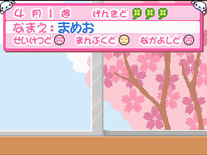
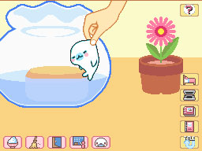
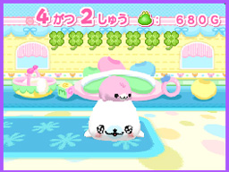
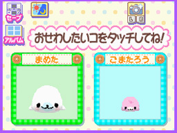
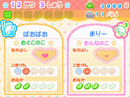
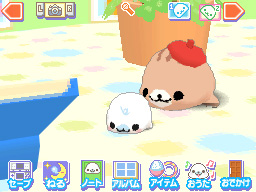
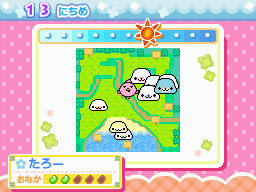
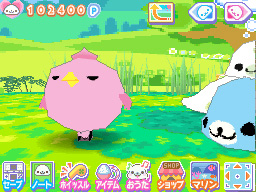

# 豆芝麻海豹调研与仓鼠美术方向

调研日期：2026-09-14。

## 用户要求与本稿范围

用户明确指定「豆芝麻海豹」这个古早掌机游戏元素，要求先充分调研，仓鼠游戏的美工风格依照它制作。它是核心美术参考，同时也是捧起小动物等直接互动的参考。此前将名字写成「豆芝麻、汤豹」属于误读。

用户给出的真实仓鼠笼照片提供设施与布置参考；将它与指定的掌机美术结合，是本稿提出的设计建议。用户在本轮进一步确认参考的是「室内养小海豹、可以捏起和滚动的 DS 版本」。已确认室内养育路线，具体卡带标题尚未唯一确定。

本次核对了 San-X 角色官方介绍、四部 DS 游戏的任天堂产品页，以及下载并逐张查看的八张任天堂原始游戏截图。另检索了发行商资料、同期报道与实机视频入口，用于交叉核查和后续追踪。未运行原作，也未逐帧观看实机录像。动画时长、触摸反馈延迟与音色不作为已验证事实。

## 一、名称与作品辨认

「まめゴマ／Mamegoma」是 San-X 的手掌大小海豹角色。官方介绍强调可以在家养、亲近人、圆滚滚且软乎乎，有不同毛色和花纹；角色于 2005 年 5 月登场。

来源：[San-X 官方角色页](https://www.san-x.co.jp/ja/characters/mamegoma/)。

中文「豆芝麻海豹」可用来检索这套角色及相关游戏，但仅凭这个称呼无法确定用户记忆中的具体作品。与当前项目相关的 DS 游戏如下：

| 作品 | 发售日期 | 官方确认的特点 | 本项目参考价值 |
| --- | --- | --- | --- |
| まめゴマほのぼの日記 | 2007-07-26 | 喂食、清洁、外出；教词语；抚摸与挠痒 | 直接照顾小动物；画面中手与动物的关系 |
| まめゴマ2 うちのコがイチバン！ | 2008-07-31 | 同时照顾两只；亲子互动；水中游泳；教姿势 | 室内养育画面、亲密观察、小动物比例 |
| クプ～！！まめゴマ！ | 2009-07-16 | 官方明确写有 3D 空间、捏起与滚动、两只互动；喂食、换装、哼唱 | 对应玩家触摸、移动动物的核心体验 |
| まめゴマ3 かわいいがいっぱい！ | 2010-08-05 | 广场里最多同时养八只；合唱与行进；种植喂食；50 种角色 | 小动物自主活动、户外配色与群体观察 |

官方来源分别为：[2007](https://www.nintendo.co.jp/ds/software/a5mj/index.html)、[2008](https://www.nintendo.co.jp/ds/software/cmmj/index.html)、[2009](https://www.nintendo.co.jp/ds/software/b53j/index.html)、[2010](https://www.nintendo.co.jp/ds/software/bg8j/index.html)。

注意：2009 年作品的官方介绍称其为系列第三弹，而 2010 年作品的标题又叫「まめゴマ3」。调研与后续沟通应使用年份和完整标题区分，避免把两部合并。检索中的「mamegoma3」旧网址也可能指向 2009 年作品。

## 二、实际截图对比

### 2007：手直接进入养育画面

截图可见：上屏用粉色条形面板显示状态，背景有窗户；下屏摆着鱼缸和盆栽，一只画出的手捏起小海豹。角色有明显外轮廓，场景较平面，底部和右侧是小图标。

对仓鼠游戏最直接的启发：捧起动物应当成为可看见的场景互动，动物离地后的姿势和反应值得单独设计。

来源：[任天堂 2007 截图页](https://www.nintendo.co.jp/ds/software/a5mj/ss01.html)，原图为同目录的 ss01a.jpg、ss01b.jpg。

### 2008：装饰性房间与小动物特写

截图可见：蓝白地面、黄色墙面、粉色椅子和玩具共同构成明亮的房间。前景白色海豹体型圆、眼睛小、嘴鼻集中、肢体很短；后面有一只较小的粉色海豹。触摸屏用两张绿色卡片选择照顾对象，四周有彩色图标和花形装饰。

这一版的场景和角色有简单立体感，与扁平的装饰界面结合。不能把整个系列简单归为统一的纯像素画。

来源：[任天堂 2008 截图页](https://www.nintendo.co.jp/ds/software/cmmj/ss01.html)，原图为同目录的 ss01a.jpg、ss01b.jpg。

### 2009：简单立体场景与直接照顾

截图可见：上屏放置两张带花边的状态卡，分别显示名字、心形和图标；下屏是带简单阴影的房间，前景有小海豹和较大的戴帽海豹。地面以奶黄、浅蓝、浅粉色块装饰，盆栽和蓝色家具具有简化的几何形态。操作图标排列在底部，主场景占据其余区域。

官方截图说明明确表示房间可以从 360 度照顾小海豹；产品介绍明确提到捏起和滚动。

来源：[任天堂 2009 房间截图页](https://www.nintendo.co.jp/ds/software/b53j/ss01.html)及[产品页](https://www.nintendo.co.jp/ds/software/b53j/index.html)。

### 2010：更宽阔、颜色更鲜明的活动场地

截图可见：上屏采用地图和状态界面，下屏出现绿色草地、池塘、海豹和粉色鸟。草地、蓝色水面与粉色角色颜色较鲜明，底部有一排彩色操作图标。地图框、圆点纹样与花形装饰延续了系列的可爱界面语言。

该截图选自官方的捣乱角色介绍页，不能将鸟、地图或巡逻机制直接推定为仓鼠游戏需要的内容。对本项目有用的是配色、角色简化和小动物在场地里的表现。

来源：[任天堂 2010 截图页](https://www.nintendo.co.jp/ds/software/bg8j/ss02.html)及[产品页](https://www.nintendo.co.jp/ds/software/bg8j/index.html)。

## 三、可转化为制作要求的美术特征

以下是基于原图的分析与本项目建议，不是原作开发规范。

### 角色

- 身体首先读成一颗完整、圆润的团子，四肢和脸部细节服从大轮廓。
- 小眼睛、小鼻嘴、短肢体使表情在很小的画面中依然清楚。
- 用身体姿态与少量表情变化表达情绪；仓鼠仍应保留圆耳、鼓腮、前爪等物种特征。
- 毛色使用清楚的大色块。建议首只仓鼠为奶白或浅米色，配浅棕背纹与粉耳。
- 团成球和趴成鼠饼应分别画出轮廓，不能只把同一张立姿图等比例缩放。

### 场景

- 采用简化形体和易辨认的物件；真实笼子的滚轮、小屋、木桥和食盆转成玩具般的造型。
- 参考图中的密集木屑可以归纳为底色加少量纹理，给仓鼠和小动作留出清楚的轮廓。
- 室内路线可参考 2008—2009 年作品的简单立体感；固定略俯视机位是本项目建议，尚未由用户选定。
- 保留动物在空间中走动的前后关系、遮挡和柔和落地阴影。

### 配色与界面

- 角色用柔和浅色，场景和按钮允许明亮的蓝、绿、黄、粉。
- 系列并非所有画面都低饱和。调色时应逐项比较动物、地面、家具和操作图标。
- 界面可参考小图标、圆润边框、花形装饰和短提示。仓鼠项目可将装饰换成种子、爪印或小花。
- DS 双屏的信息分工可转化为主画面加一小块状态区；是否复刻双屏布局仍待产品选择。

### 画面质感

- 已查看的任天堂原图尺寸为 256×192，低分辨率对观感有明显影响。
- 早期较平面的画面与后续简单立体画面应分别处理。观察到的像素边缘不能单独证明素材是手绘像素精灵。
- 如果选择后期 DS 观感，建议保留简单模型或带立体感的绘制、有限细节、清楚色块和低分辨率呈现。
- 最终技术方案可为 2D、2.5D 或简化 3D；先用角色与笼子的静态样稿确认美术，再确定实现方式。

## 四、与用户玩法连接

| 用户已有玩法 | 建议的视觉表现 |
| --- | --- |
| 捧起、拖动 | 手或托举提示进入画面；仓鼠离地后缩爪、蜷身；落地另有短反应 |
| 团成球、鼠饼 | 同一只仓鼠的独立姿态；耳朵、花纹、腮部保持一致 |
| 低体力跑不动 | 步幅变小、停顿增加、眼皮下垂，状态读数作为辅助 |
| 睡着后拖醒 | 睁眼、抬头、回应；符合睡眠条件时，约十秒未互动后重新入睡 |
| 在滚轮里睡着 | 先跑动，再减速，最后趴下，保持连续的动作关系 |
| 找不到食物 | 回原处、嗅闻、寻找、抓耳挠腮、坐下委屈；各阶段有独立姿态 |

这些是仓鼠项目的动作设计建议。藏食物、十秒再睡、滚轮睡着均来自用户，不将其写成原作已确认的机制。捏起、滚动、抚摸等与原作官方描述具有对应关系。

## 五、当前可采用的概念表述

「以豆芝麻海豹 DS 养成游戏的角色比例、明亮可爱界面和直接触摸互动为核心参考，把手掌大小、圆团状的小动物换成仓鼠。玩家在简化的仓鼠笼中观察、捧起、喂食和陪玩，仓鼠通过团成球、趴成饼、困倦和委屈等姿态表达状态。」

用户已经确认室内养育、捏起和滚动的 DS 版本。因此重点参考 2007 年的手部互动与 2008—2009 年的室内画面，其中 2009 年官方产品介绍明确包含捏起与滚动。2010 年广场只用于版本对照，主美术方向以室内路线为准。尚不能仅据这些描述断定用户记忆中的唯一卡带标题。

## 六、后续美术验收与待核实事项

美术样稿应首先交付同一只仓鼠的站立、球形、饼形、被捧起四种姿态，以及一张含滚轮、小屋和食盆的笼子主画面。对照原版截图检查身体比例、五官大小、色块、物件简化程度和画面中角色大小。

动作制作前，还需核对具体版本的实机录像：捏起后的姿势、滚动的动作规律、触摸反馈、待机动作及声音。此次只找到录像入口，未完成逐帧验证，暂不规定原作动作时长或音色。

- [2008 年作品实机录像入口](https://www.youtube.com/watch?v=B8MoL0tqgPM)：第三方实机记录，用于下一阶段动作核对。
- [2009 年官方哼唱截图说明](https://www.nintendo.co.jp/ds/software/b53j/ss02.html)：确认存在哼唱，不足以核实实际音色。
- [2010 年官方合唱截图说明](https://www.nintendo.co.jp/ds/software/bg8j/ss03.html)。

原始截图仅用作调研参照，当前仓鼠美术资产尚未绘制。
